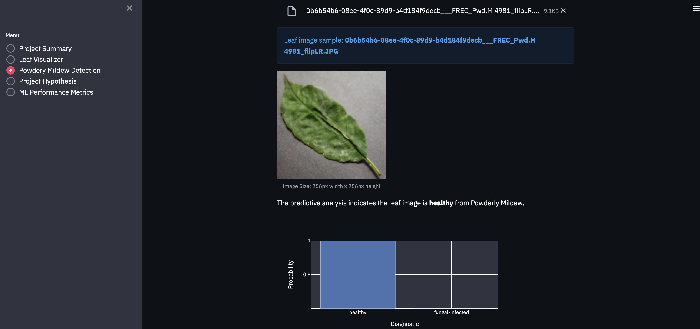
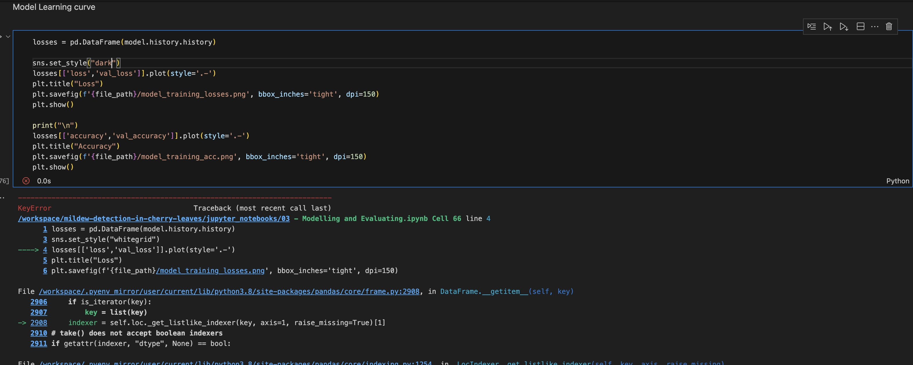
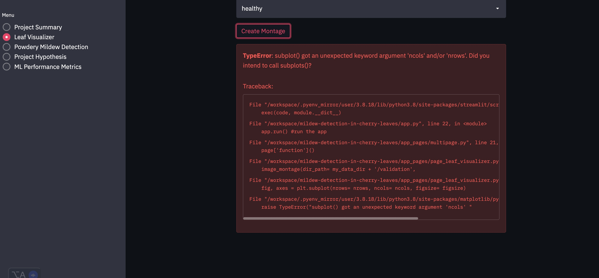
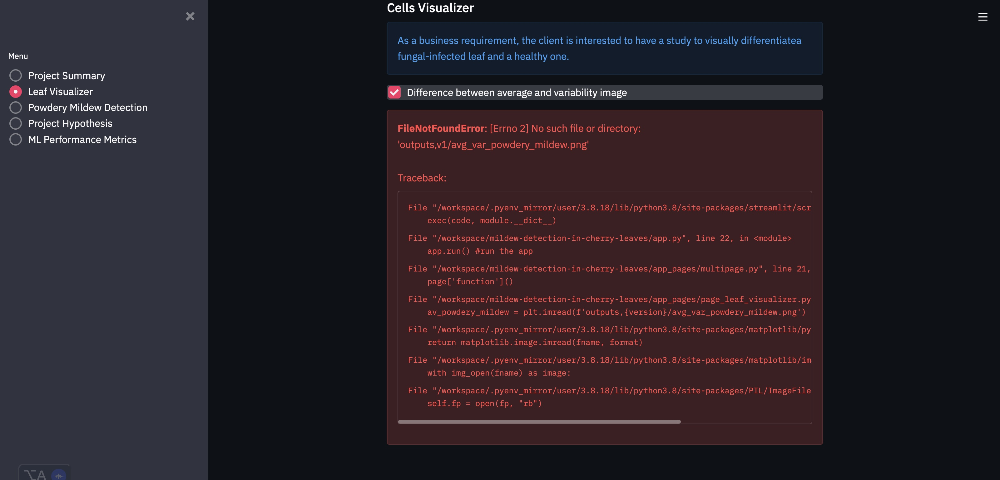
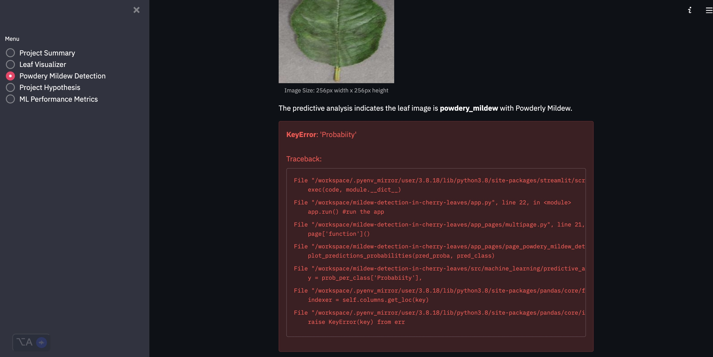
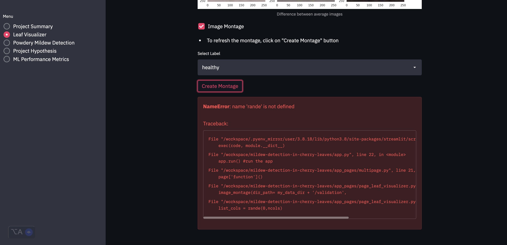
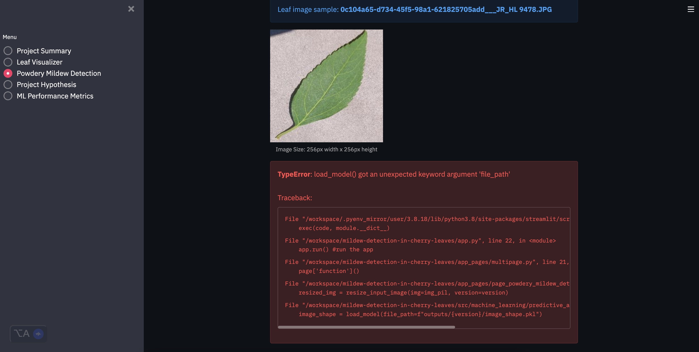

# Bugs

### Minor fixed bugs 

#### Some of the bugs listed here were addressed during the development of the app.

##### 1 Mixed labels

After adjusting the label for the 'fungal-infected' class, the model consistently provided correct predictions when new data was input. This issue was resolved by modifying the key indexes in the predictive_analysis.py file. Specifically, the change involved swapping the positions of the 0 and 1 indexes.

index={'healthy': 1, 'fungal-infected': 0}.keys()

After this minor adjustment, the model resumed accurate predictions each time an image was uploaded through the Streamlit app.

##### 2 Not accepting  boolean indexers

##### 3 Unexpected key word argument 

##### 4 File not found

#### 5 Key 'Probability' had a typo

#### 6 Image montage had a typo in 'render'

#### 7 Filepath was wrongly given 

